# Exhibition Registration System – Victoria University

A Java-based **desktop registration management system** built for the **Victoria University SALSA Dance Festival**.  
This system automates participant registration, image handling, and table printing while connecting to a **Microsoft Access** database using **UCanAccess JDBC**.

---

## Key Features

**Login Authentication** – Restricts access to authorized users only 
**Tabbed Pane Interface** – Two main Tabs.
   - *Registration Form* – Add and edit participant details  
   - *Records Table* – View all participants and print reports 
**CRUD Support** – Register, Search, Update, Delete participants in Access DB.  
**Image Upload** – Upload and rename images to match participant Registration ID.
**Search Function** – Retrieve participant data by Registration ID 
**Real-Time Table View** – Auto-refreshes after any operation.  
**Print Function** – Print participant list directly from JTable.  
**Data Validation** – Prevents duplicates, invalid emails, and empty fields.  

---

## Technologies Used

| Component | Technology |
|------------|-------------|
| **Programming Language** | Java (JDK 24) |
| **IDE** | Apache NetBeans 27 |
| **Database** | Microsoft Access (.accdb) |
| **Connectivity Driver** | UCanAccess JDBC |
| **GUI Toolkit** | Java Swing |
| **Build Tool** | Maven |
| **File Handling** | Java I/O & NIO (Files.copy) |

---

## Project Directory Structure

	ExhibitionRegistration/
		│
		└── src/
	
			└── main/
			
				└── java/
				
					└── vu/
					
						└── ExhibitionRegn/
						
							├── ExhibitionSystem.java # Main JFrame Form
							
							├── VUE_Exhibition.accdb # Access Database	
							
							├── images/ # Uploaded Participant Images
													
							├── README.md # Project Documentation

---

## Database Design

The system requires two main tables:  
1️. `users` – for login authentication  
2️. `participants` – for storing exhibition participant details  

### Table: `users`
| Column Name | Data Type | Description |
|--------------|------------|-------------|
| userID | AUTONUMBER / INT (PK) | Unique user identifier |
| username | VARCHAR(50) | Login username |
| password | VARCHAR(50) | Login password |
| role | VARCHAR(20) | Optional (e.g., “admin”, “organizer”) |

**Sample Data:**

`	sql
	
	INSERT INTO users (username, password, role)
	VALUES
	('admin', '12345', 'Administrator'),
	('Patrick', '1234', 'Administrator'),
	('Salim', '1234', 'Lecturer'),
	('Hope', '1234', 'Guest');

Table: participants
| Column Name	| Data Type	| Description |
|--------------|------------|-------------|
| regID	| VARCHAR(10) (PK)	| Unique registration ID (e.g., REG001) |
| fullName	| VARCHAR(100)	| Participant’s full name |
| department	| VARCHAR(100)	| University department |
| partner	| VARCHAR(100)	| Dancing partner’s name |
| contact	| VARCHAR(20)	| Phone number |
| email	| VARCHAR(100)	| Email address |
| imagePath	| VARCHAR(255)	| File path to participant’s ID image |

Sample Data:

`	sql

	INSERT INTO participants (regID, fullName, department, partner, contact, email, imagePath)
	VALUES
	('REG001', 'Mike Okello', 'HS', 'Joy', '94802470927', 'mike@example.com', 'src\main\java\vu\exhibitionRegn\images\REG001.png'),
	('REG002', 'John', 'IT', 'N/A', '099876554', 'john@gmail.com', 'src\main\java\vu\exhibitionRegn\images\REG002.png');

## How It Works

**1 Login Form** – User enters username and password.

	Credentials are validated against the users table.

	Successful login opens the main window; invalid login shows an error.

**2️ Main Interface** – Contains two tabs:

	Registration Tab – Add, edit, or delete participant records.

	Records Tab – View all participants in a table and print reports.

**3️ Database Layer** – Handles all SQL operations using prepared statements for security.

**4️ Validation** – Ensures no empty fields, valid email format, and unique IDs.

## How to Run

**Clone the repository:**

git clone https://github.com/etopat/ExhibitionRegistration_VU.git

Open in NetBeans or IntelliJ IDEA.

Ensure Maven dependencies are downloaded.

Create the database tables using the SQL scripts above.

Run ExhibitionRegn.java as the main entry point.

---

## Setup & Configuration

### 1️ Prerequisites

Install:
- Java JDK 24+
- Apache NetBeans 27
- Microsoft Access
- UCanAccess Driver (ucanaccess.jar, jackcess.jar, commons-lang.jar, etc.)

### 2️ Database Path Setup

In **DBConnection.java**, set your database connection as:

	String url = "jdbc:ucanaccess://C:/Users/Dell/Documents/NetBeansProjects/ExhibitionRegistration/src/main/java/vu/ExhibitionRegn/VUE_Exhibition.accdb";

	Ensure that the slashes / are forward slashes in Java file paths.

### JDBC Connection URL
In Java, connection URLs for UCanAccess take this format:

String url = "jdbc:ucanaccess://<absolute_path_to_database>";

For this project:

	String url = "jdbc:ucanaccess://C:/Users/Dell/Documents/NetBeansProjects/ExhibitionRegistration/src/main/java/vu/ExhibitionRegn/VUE_Exhibition.accdb";

### 3️ Adding Libraries in NetBeans

### Option 1: Manual Dependency Setup (Classic Method)

If you’re not using Maven, follow these steps:

Required Libraries:

ucanaccess.jar

jackcess.jar

commons-lang.jar

commons-logging.jar

hsqldb.jar

	All of these JARs must be in your project’s classpath for the connection to work.

#### Steps to Add in Apache NetBeans (JDK 24)

Right-click your Project > Properties

Go to Libraries > Compile Tab

Click Add JAR/Folder

Select all the above .jar files

Press OK and Clean & Build your project

	If correctly added, NetBeans will list them under Libraries in your project tree.

You can verify successful linkage by checking:

Database connected successfully!

in the NetBeans console when running.

### Option 2: Maven Dependency Management (Recommended)

If your project uses Maven, you don’t need to manually download or add .jar files. Maven automatically downloads all libraries and their transitive dependencies from the central repository.

#### Step 1: Convert Project to Maven

In NetBeans:

Right-click project → Convert to Maven Project

#### Step 2: Add UCanAccess to pom.xml

Insert the following <dependencies> section:

	<dependencies>
	    <!-- UCanAccess Core Driver -->
		<dependency>
			<groupId>net.sf.ucanaccess</groupId>
			<artifactId>ucanaccess</artifactId>
			<version>5.0.1</version>
		</dependency>
	    
	    <!-- Additional optional dependencies -->
	    <dependency>
	        <groupId>commons-lang</groupId>
	        <artifactId>commons-lang</artifactId>
	        <version>2.6</version>
	    </dependency>
	
	    <dependency>
	        <groupId>commons-logging</groupId>
	        <artifactId>commons-logging</artifactId>
	        <version>1.2</version>
	    </dependency>
		
		<dependency>
        <groupId>org.hsqldb</groupId>
        <artifactId>hsqldb</artifactId>
        <version>2.7.2</version>
        <scope>runtime</scope>
    </dependency>
</dependencies>

#### Step 3: Build the Project

After saving, NetBeans automatically downloads the libraries.

Go to:

Project > Dependencies

	You’ll now see all JARs resolved automatically.

### 4️⃣ Run the Program

Use NetBeans Run Project ▶️ or from terminal:

java -jar ExhibitionRegistrationSystem.jar

GUI Overview
Tab	Description
Registration Form	Capture details, validate inputs, upload ID image
Participants Table	Displays all records with print and refresh options

### Sample Use Case

1️⃣ Open app
2️⃣ Fill in Registration details
3️⃣ Upload ID image (auto-renamed to Reg ID, e.g. REG001.jpg)
4️⃣ Click Register
5️⃣ View all records in Table Tab
6️⃣ Use Print to output table to printer

# Sample Login Credentials

| Username	| Password	| Role |
|--------|--------|----------|
| admin	| 12345	| Administrator |
| Patrick | 1234 | Administrator |
| Hope	| 1234	| Guest |
| Salim | 1234 | Lecturer |

### Screenshots

### Login Screen

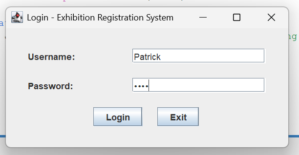

### Users Table (Login Information)

### Greeting on Login

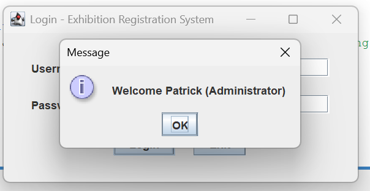

### Registration Form

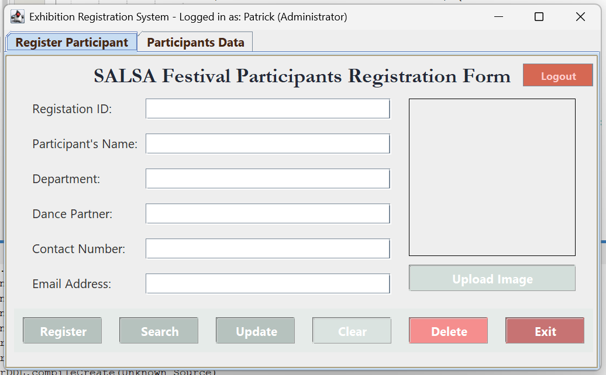

### Registration Validation

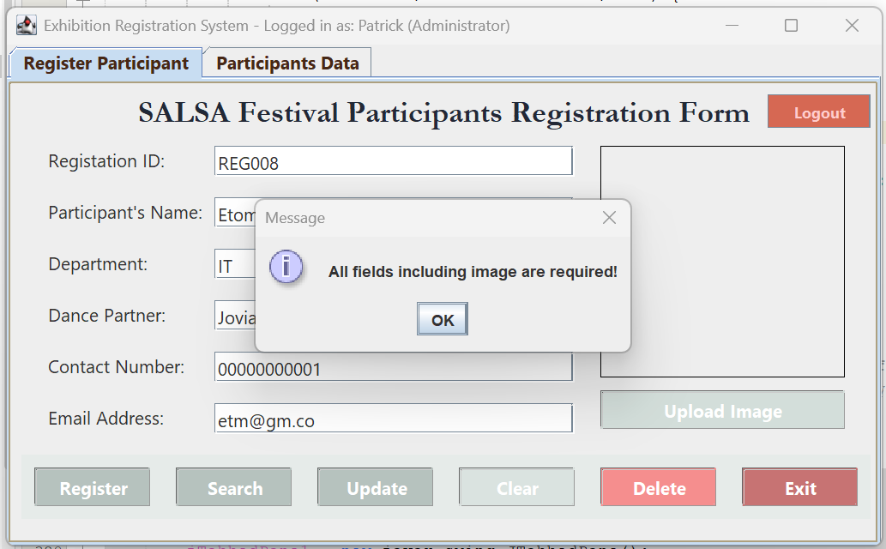

### Successful Registration Popup

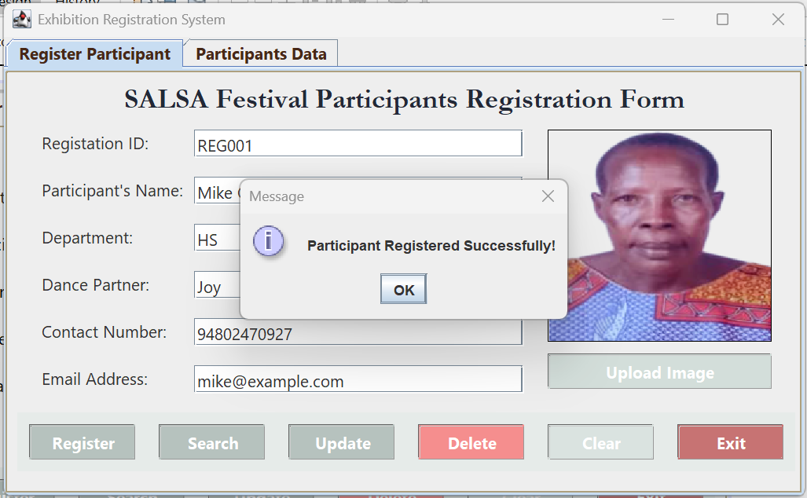

### Search Participant

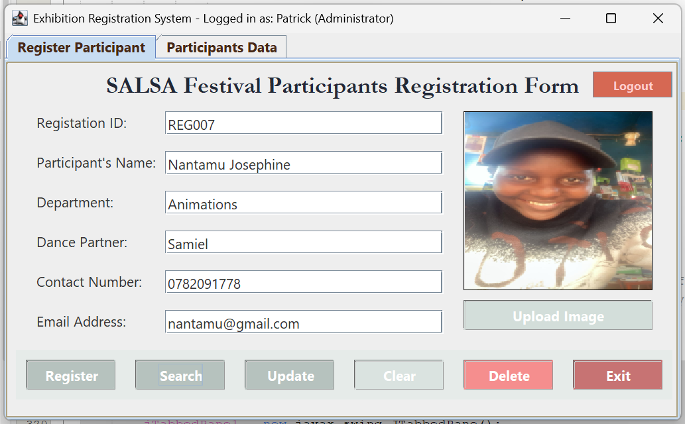

### No Record Found Popup

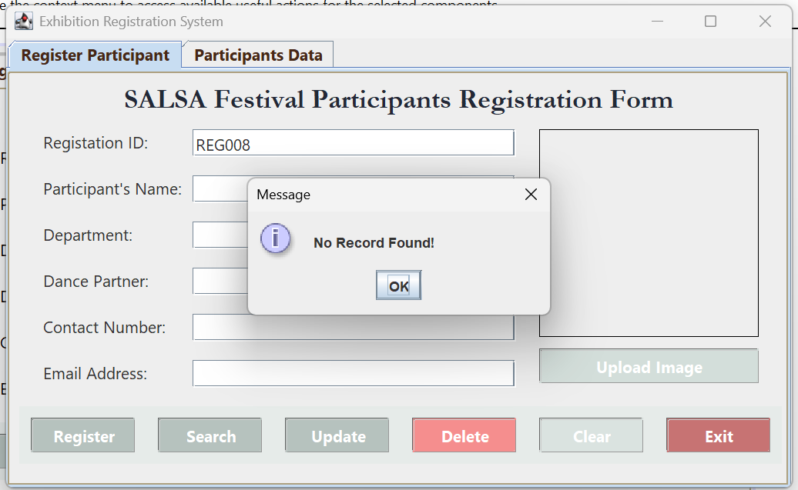

### Participants Table Tab

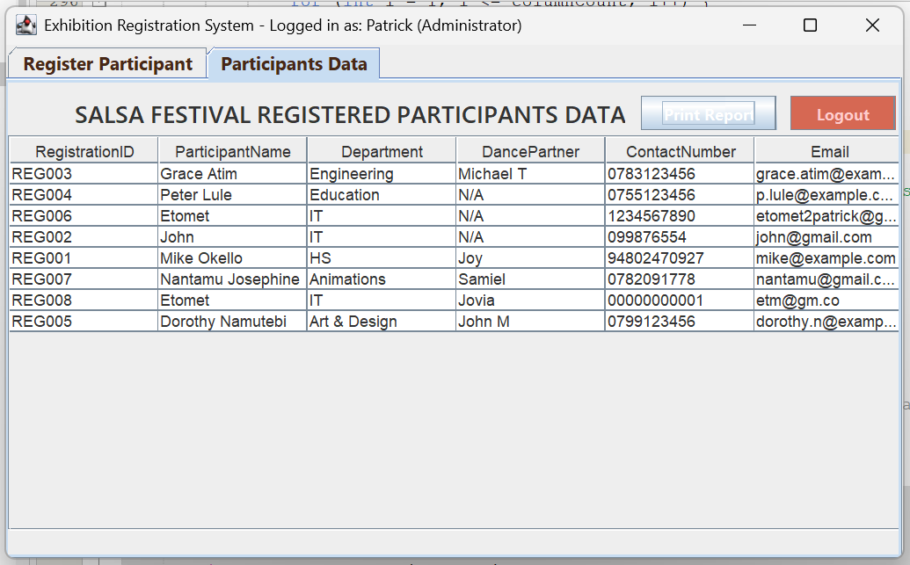

### Print Dialogue Box

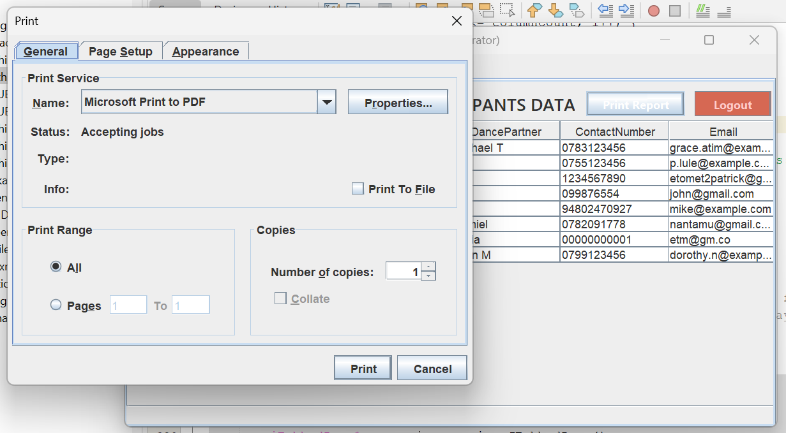

### Printing in Proogress

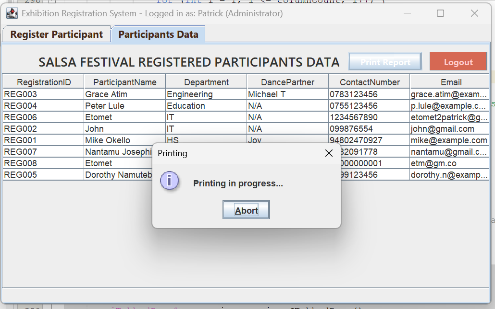

### Cancelled Printing Job

### Successful Printing Allert

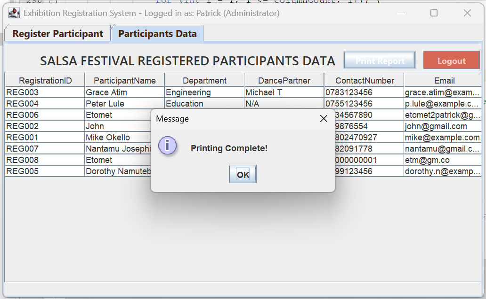

### Logout COnfirmation

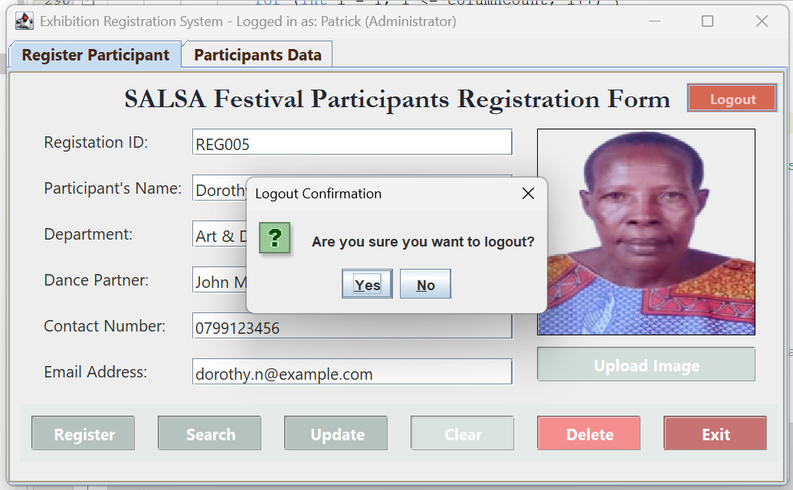

### Input Validation
| Field | Validation |
|-------|---------|
| Registration | ID	Must be unique (e.g., REG001) |
| Name |	Cannot be empty |
| Email |	Checked with regex pattern |
| Contact |	Numeric only |
| Image |	Required before submission |

### Printing Feature
Print the full participant list directly from the table:
boolean printed = tblParticipants.print();
if (printed) {
    JOptionPane.showMessageDialog(this, "Table printed successfully!");
}

### Future Enhancements

Export participant list to PDF

Add search filters & sorting

Add Login (Admin/Clerk roles)

Switch from Access to MySQL

### Authors
| # | NAME	| REG. NUMBER |
|------|-----------|----------|
| 1. | ETOMET PATRICK | VU-BBC-2411-1019-DAY |
| 2. | ISAAC VICTOR  | VU-DIT-2411-1595-DAY |
| 3. | WALIGO SALIM | VU-DIT-2411-0215-DAy |
| 4. | NAMATOVU HOPE | VU-DIT-2411-0047-DAY |
| 5. | TUKEI MARK | VU-BIT-2411-0565-DAY |

Victoria University – Faculty of Computing

### October 2025

---

### License
MIT License © 2025 Patrick Etomet
Permission is granted for educational and academic use only.

### GitHub Repository

🔗 https://github.com/etopat/ExhibitionRegistrationSystem_VU

# Tip: Keep your .accdb file and /images directory inside the same project folder to ensure portability.

